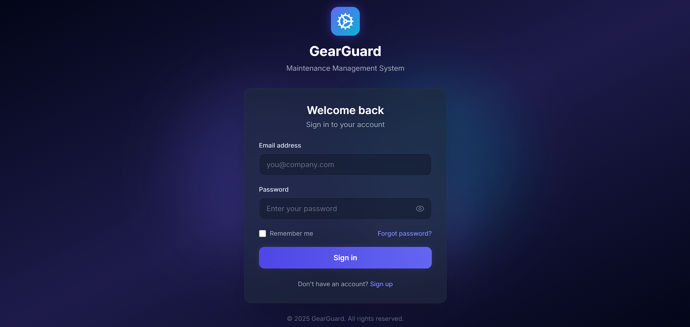
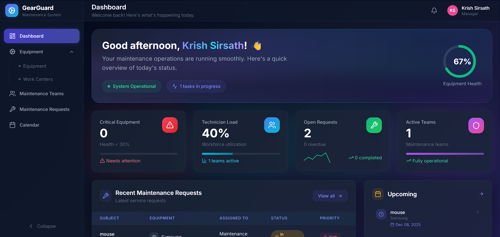
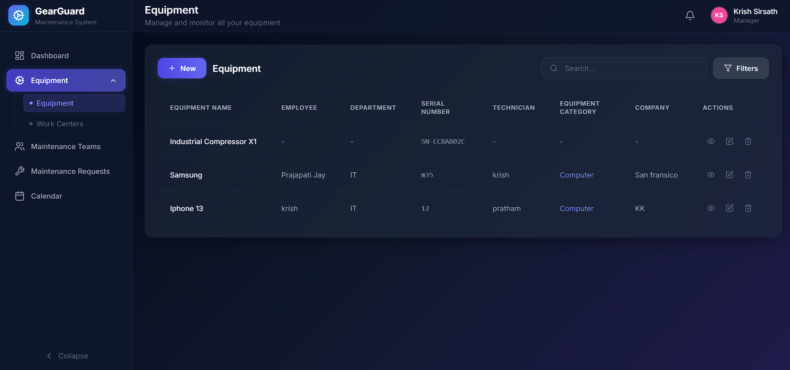
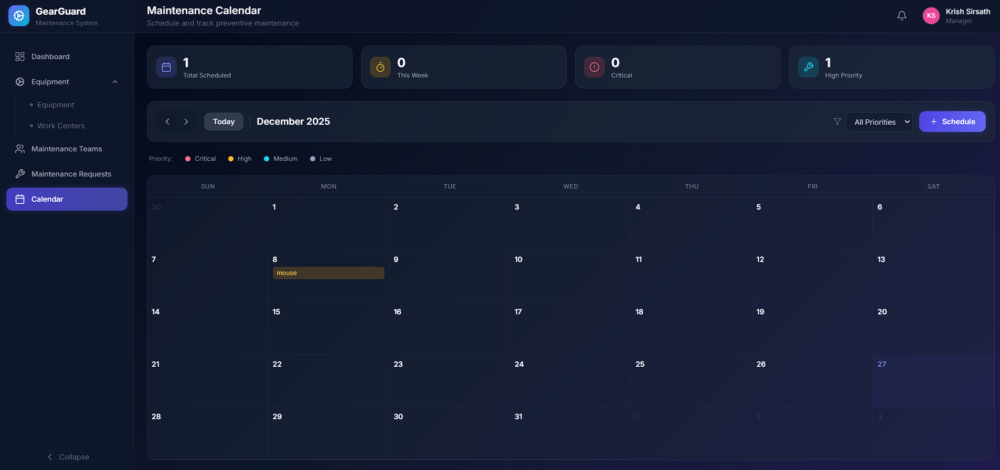

# 🛠️ GearGuard - The Ultimate Maintenance Tracker

<div align="center">


**A comprehensive equipment and maintenance management system built with modern web technologies**

🌐 **[Live Demo](https://oddoevent.vercel.app)**

[](https://nodejs.org/)
[](https://reactjs.org/)
[](https://www.postgresql.org/)
[](https://tailwindcss.com/)
[](https://expressjs.com/)

</div>

---
## 📸 Screenshots

### Login Page


### Dashboard
> Modern dashboard with real-time statistics, animated counters, and maintenance overview


### Equipment Management
> Comprehensive equipment listing with search, filter, and status tracking


### Maintenance Requests
> Track and manage maintenance requests with priority levels and status updates


### Team Management
> Organize maintenance teams and track assignments


### Calendar View
> Visual calendar for scheduling and tracking maintenance activities


---

## 📋 Table of Contents

- [Overview](#-overview)
- [User Roles](#User-Roles)
- [Features](#-features)
- [Tech Stack](#-tech-stack)
- [Project Structure](#-project-structure)
- [Getting Started](#-getting-started)
  - [Prerequisites](#prerequisites)
  - [Installation](#installation)
  - [Environment Variables](#environment-variables)
  - [Database Setup](#database-setup)
  - [Running the Application](#running-the-application)
- [Contributing](#-contributing)

---

## 🎯 Overview

**GearGuard** is a full-stack maintenance management system designed to help organizations efficiently track, manage, and maintain their equipment and work centers. It provides a centralized platform for managing maintenance requests, tracking equipment lifecycle, organizing maintenance teams, and scheduling preventive maintenance tasks.

Whether you're managing a small workshop or a large industrial facility, GearGuard helps you:
- 📊 Keep track of all your equipment in one place
- 🔧 Manage corrective and preventive maintenance requests
- 👥 Organize maintenance teams and assign tasks
- 📅 Schedule and track maintenance activities
- 📈 Monitor equipment health and maintenance metrics

---

## 👤 User Roles

GearGuard supports three distinct user roles, each with specific responsibilities and access levels:

| Role | Description | Key Responsibilities |
|------|-------------|---------------------|
| **🧑‍💼 Employee** | Reports equipment issues and tracks their status | • Create maintenance requests for faulty equipment<br>• Track the status and progress of submitted requests<br>• View equipment assigned to them |
| **🔧 Technician** | Handles repairs and maintenance tasks | • View and manage assigned maintenance requests<br>• Update repair progress and status<br>• Log repair time and maintenance notes<br>• Mark requests as completed |
| **👨‍💼 Manager/Admin** | Oversees the entire maintenance system | • Manage equipment inventory and categories<br>• Create and manage maintenance teams<br>• Assign work orders to technicians/teams<br>• Schedule preventive maintenance<br>• Monitor system health and analytics<br>• Manage users and access permissions |

---

## ✨ Features

### 🔐 Authentication & Authorization
- Secure user authentication with JWT tokens
- Role-based access control (Employee, Technician, Manager/Admin)
- Password encryption with bcrypt
- Protected routes and API endpoints

### 📦 Equipment Management
- Add, edit, and delete equipment records
- Track equipment details (serial number, purchase date, warranty, etc.)
- Categorize equipment by type
- Assign equipment to employees and technicians
- Monitor equipment status (Operational, Under Maintenance, Out of Service)

### 🏭 Work Center Management
- Create and manage work centers/locations
- Associate equipment with work centers
- Track work center maintenance needs

### 🔧 Maintenance Requests
- Create corrective and preventive maintenance requests
- Set priority levels (Low, Medium, High, Critical)
- Track request status (Open, In Progress, Completed, Cancelled)
- Assign requests to maintenance teams
- Schedule maintenance with due dates

### 👥 Team Management
- Create maintenance teams
- Add/remove team members
- Assign teams to maintenance requests
- Track team workload and performance

### 📅 Calendar View
- Visual calendar for scheduled maintenance
- View upcoming and overdue tasks
- Easy scheduling interface

### 📊 Dashboard & Analytics
- Real-time statistics and metrics
- Equipment status overview
- Maintenance request summary
- Activity tracking
- Visual progress indicators

---

## 🛠️ Tech Stack

### Frontend
| Technology | Purpose |
|------------|---------|
| **React 19** | UI Library |
| **Vite** | Build Tool & Dev Server |
| **React Router v7** | Client-side Routing |
| **Tailwind CSS** | Styling & UI Components |
| **Axios** | HTTP Client |
| **Lucide React** | Icons |
| **date-fns** | Date Formatting |

### Backend
| Technology | Purpose |
|------------|---------|
| **Node.js** | Runtime Environment |
| **Express.js 5** | Web Framework |
| **Sequelize** | ORM for PostgreSQL |
| **PostgreSQL** | Database |
| **JWT** | Authentication |
| **bcryptjs** | Password Hashing |
| **Helmet** | Security Headers |
| **Morgan** | HTTP Request Logger |
| **express-validator** | Input Validation |

---

## 📁 Project Structure

```
GearGuard-The-Ultimate-Maintenance-Tracker/
├── backend/                    # Backend API server
│   ├── index.js               # Entry point
│   ├── package.json           # Backend dependencies
│   ├── scripts/
│   │   └── syncDb.js          # Database sync script
│   └── src/
│       ├── config/
│       │   └── database.js    # Database configuration
│       ├── controllers/       # Route controllers
│       │   ├── authController.js
│       │   ├── categoryController.js
│       │   ├── equipmentController.js
│       │   ├── maintenanceRequestController.js
│       │   ├── teamController.js
│       │   ├── userController.js
│       │   └── workCenterController.js
│       ├── middleware/        # Express middleware
│       │   ├── auth.js
│       │   ├── errorHandler.js
│       │   └── validation.js
│       ├── models/            # Sequelize models
│       │   ├── Equipment.js
│       │   ├── EquipmentCategory.js
│       │   ├── MaintenanceRequest.js
│       │   ├── MaintenanceTeam.js
│       │   ├── TeamMember.js
│       │   ├── User.js
│       │   └── WorkCenter.js
│       ├── routes/            # API routes
│       ├── services/          # Business logic
│       └── utils/             # Utility functions
│
├── frontend/                   # React frontend
│   ├── index.html             # HTML entry point
│   ├── package.json           # Frontend dependencies
│   ├── vite.config.js         # Vite configuration
│   ├── tailwind.config.js     # Tailwind configuration
│   └── src/
│       ├── App.jsx            # Main App component
│       ├── main.jsx           # React entry point
│       ├── components/        # Reusable components
│       │   ├── common/        # Common UI components
│       │   │   ├── Alert.jsx
│       │   │   ├── Avatar.jsx
│       │   │   ├── Badge.jsx
│       │   │   ├── Button.jsx
│       │   │   ├── Card.jsx
│       │   │   ├── Input.jsx
│       │   │   ├── Modal.jsx
│       │   │   └── ...
│       │   └── layout/        # Layout components
│       │       ├── Header.jsx
│       │       └── Sidebar.jsx
│       ├── context/           # React Context providers
│       │   ├── AuthContext.jsx
│       │   └── NotificationContext.jsx
│       ├── hooks/             # Custom React hooks
│       ├── layouts/           # Page layouts
│       ├── pages/             # Page components
│       │   ├── Dashboard.jsx
│       │   ├── Equipment.jsx
│       │   ├── EquipmentDetail.jsx
│       │   ├── EquipmentCategories.jsx
│       │   ├── MaintenanceRequests.jsx
│       │   ├── Teams.jsx
│       │   ├── TeamDetail.jsx
│       │   ├── WorkCenters.jsx
│       │   ├── Calendar.jsx
│       │   ├── Login.jsx
│       │   ├── Signup.jsx
│       │   ├── Profile.jsx
│       │   └── Settings.jsx
│       ├── services/          # API service layer
│       └── utils/             # Utility functions
│
└── README.md                  # This file
```

---

## 🚀 Getting Started

### Prerequisites

Before you begin, ensure you have the following installed:

- **Node.js** (v18 or higher) - [Download](https://nodejs.org/)
- **PostgreSQL** (v14 or higher) - [Download](https://www.postgresql.org/download/)
- **npm** or **yarn** - Comes with Node.js

### Installation

1. **Clone the repository**
   ```bash
   git clone https://github.com/krish3276/GearGuard-The-Ultimate-Maintenance-Tracker.git
   cd GearGuard-The-Ultimate-Maintenance-Tracker
   ```

2. **Install backend dependencies**
   ```bash
   cd backend
   npm install
   ```

3. **Install frontend dependencies**
   ```bash
   cd ../frontend
   npm install
   ```

### Environment Variables

1. **Create a `.env` file in the `backend` directory:**

   ```env
   # Server Configuration
   PORT=5000
   NODE_ENV=development

   # Database Configuration
   DB_HOST=localhost
   DB_PORT=5432
   DB_NAME=gearguard
   DB_USER=your_postgres_username
   DB_PASSWORD=your_postgres_password

   # JWT Configuration
   JWT_SECRET=your_super_secret_jwt_key_here
   JWT_EXPIRES_IN=7d

   # CORS Configuration
   FRONTEND_URL=http://localhost:5173
   ```

2. **Create a `.env` file in the `frontend` directory (optional):**

   ```env
   VITE_API_URL=http://localhost:5000/api
   ```

### Database Setup

1. **Create a PostgreSQL database:**
   ```sql
   CREATE DATABASE gearguard;
   ```

2. **Sync the database schema:**
   ```bash
   cd backend
   npm run db:sync
   ```

### Running the Application

1. **Start the backend server:**
   ```bash
   cd backend
   npm run dev
   ```
   The backend will run on `http://localhost:5000`

2. **Start the frontend development server:**
   ```bash
   cd frontend
   npm run dev
   ```
   The frontend will run on `http://localhost:5173`

3. **Open your browser and navigate to:**
   ```
   http://localhost:5173
   ```

---

## 🤝 Contributing

Contributions are welcome! Here's how you can help:

1. **Fork the repository**
2. **Create a feature branch**
   ```bash
   git checkout -b feature/amazing-feature
   ```
3. **Commit your changes**
   ```bash
   git commit -m 'Add some amazing feature'
   ```
4. **Push to the branch**
   ```bash
   git push origin feature/amazing-feature
   ```
5. **Open a Pull Request**

### Development Guidelines
- Follow the existing code style
- Write meaningful commit messages
- Add comments for complex logic
- Test your changes thoroughly

---
## 👨‍💻 Author

**Krish**
- GitHub: [@krish3276](https://github.com/krish3276)

---

## 🙏 Acknowledgments

- [React](https://reactjs.org/) - The library for web and native user interfaces
- [Tailwind CSS](https://tailwindcss.com/) - A utility-first CSS framework
- [Lucide](https://lucide.dev/) - Beautiful & consistent icons
- [Sequelize](https://sequelize.org/) - Modern TypeScript and Node.js ORM
- [Express.js](https://expressjs.com/) - Fast, unopinionated web framework

---

<div align="center">

**⭐ Star this repository if you find it helpful!**


</div>
